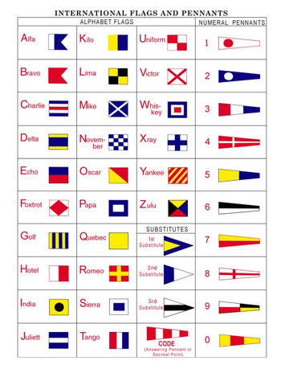

# Even Sailors need to talk
Each flag has a different story. To survive in peace and harmony, united and strong, we must have one people, one nation, one flag.

**The Flag should be wrapped in ACTF{}**
## Approach
They use a maritnime signals code which maps diffrent flags to various letters

## flag
ACTF{FLAGCANALSOBEAFLAG}