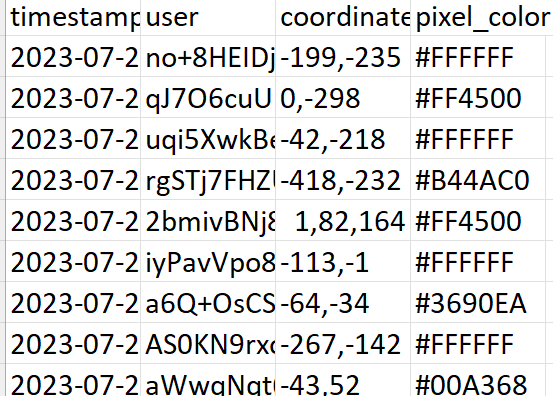

# F\*\*\* SPEZ
## Question:
I was suggested by reddit to go to a place but the coordinates were pretty weird.
Can you help me figure them out?

Longitude : -64
Latitude : -34
Time : 000000000000

**The Flag should be wrapped in aCTF{}**
## Hint:
1) \# is included in the flag
2) flag should be enncased in ACTF{}
## Approach
you had to go to r/place 2023's data/stats provided by reddit
<a href="https://www.reddit.com/r/place/comments/15bjm5o/rplace_2023_data/">link</a>. and open the full list of the pixels data,and from there you had to download 

**2023_place_canvas_history-000000000000.csv.gzip** and unzip it using gzip -d "file name" to get a csv file which can be opened in excel then seacrh for (-64,-34) which gives the pixel's coulor id

## flag:
ACTF{#3690EA}
